# McFarlane Tyres  
## HND Software Development Graded Unit

### Overview

McFarlane Tyres is a tyre ordering and management app built using Swift developed as part of my Graded Unit project. The application showcases a thorough understanding of Object-Oriented Programming principles, SwiftUI design and persistent data storage through SwiftData.

The McFarlane Tyres app was built on a solid foundation established during the analysis and design stages. Clear system modelling guided the app’s development. Key design choices included setting up class hierarchies for the data models, using manager classes to keep different parts of the code organised and building the user interface with a modular SwiftUI structure. Together, these elements ensure the app delivers a smooth and user-friendly experience.

The app offers a tailored experience depending on the user’s role, with admins granted full control over the system and staff limited to viewing orders. Customers are able to search for and order tyres, manage their accounts and review their past orders. Behind the scenes, more complex features like password hashing, a filtered search, dynamic views and database seeding were handled using a well-structured architecture designed to be clean, reusable and easy to test.

---

### Features & Highlights

- **Search Functionality**: Users can filter tyres by width, profile, rim size and speed rating for easier browsing  
- **Basket & Checkout**: Tyres can be added to a basket, quantities adjusted and orders placed seamlessly  
- **Order Management**: Orders are automatically created and stored with custom details like fitting dates, vehicle registration and more  
- **Role-Based Views**: The app adapts based on user role showing tailored views for Admin, Staff and Customers  
- **SwiftData Persistence**: All data is reliably stored using Apple’s SwiftData framework  
- **Security**: Passwords are securely hashed using a salted SHA256 algorithm  
- **Seeding**: Preloaded tyres and user accounts make the app usable right from the start  

---

### Database Setup

Before running the app, make sure the in-app SwiftData database is properly initialised. This usually happens automatically the first time you launch the app:

1. Check that `TyreManager` and `UserManager` are set up to call `loadDefaultTyres()` and `loadDefaultUsers()` if no data exists  
2. Launch the app – the seeding and setup processes are triggered in the `HomeView` using `.onAppear`  
3. If the database doesn't initialise, perform a clean build (`Cmd + Shift + K`) in Xcode, delete the app from your device and then reinstall it
    
---

### Running the Application

To run the app in Xcode:

1. Open the project in Xcode  
2. Build and run the app on either the simulator or a physical device  
3. Navigate through the Home, Search, Basket and Checkout interfaces

Note: This app was developed and tested on an iPhone 16 Pro Max with the small text size setting (85%) as part of a larger assessment. While the UI is designed to scale with font sizes on this device, full scalability across all iOS devices was not prioritised

---

### Test Accounts

The following test accounts are available:

### Admin  
- **Email**: `admin`  
- **Password**: `password`  

### Staff  
- **Email**: `staff1`  
- **Password**: `password`  

### Customer  
- **Email**: `cust1`  
- **Password**: `password`  

Additional seeded user accounts are available for testing. You can refer to the `DefaultUserData.swift` file for a complete list of test accounts.

---

### Project Structure

- `Managers/` – Logic handlers: `BasketManager`, `OrderManager`, `TyreManager`, `UserManager`  
- `Models/` – Core data models: `User`, `Tyre`, `BasketItem`, `Order`, `OrderLine`  
- `Views/` – SwiftUI screens and UI components  
- `Shared/` – Reusable UI components: cards, taskbars and other common elements  
- `Seeding/` – Contains `DefaultTyreData` and `DefaultUserData` to populate the initial database

---

### Screenshots

#### Home
The main dashboard offering quick access to all core sections of the app. Users can easily navigate to search tyres, view their basket or access their account from this view.

  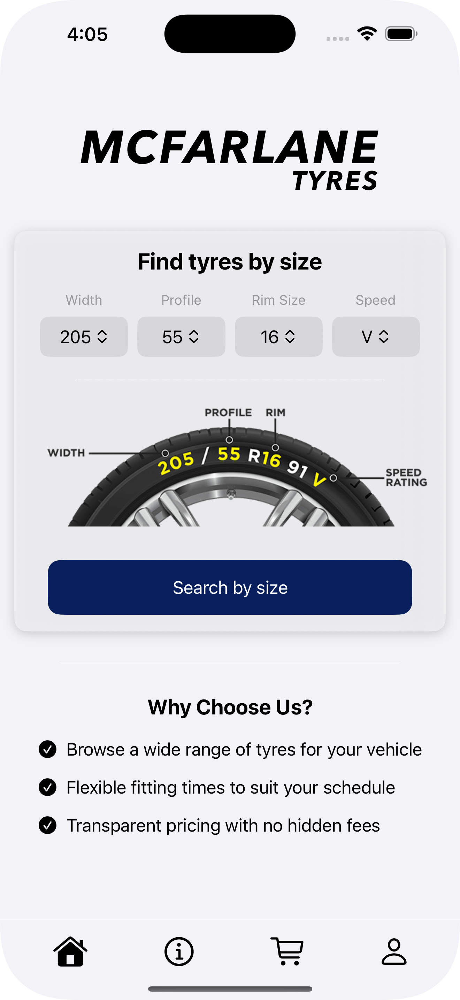

#### Search & Basket  
A streamlined interface for searching tyres using detailed filters such as width, profile, rim size and speed rating. Users can add tyres to their basket which triggers a confirmation pop-up and haptic feedback.
The basket view adapts depending on whether the user is logged in or logged out allowing logged-in users to manage their selected items, modify quantities and proceed to checkout, while guests have a limited view.

  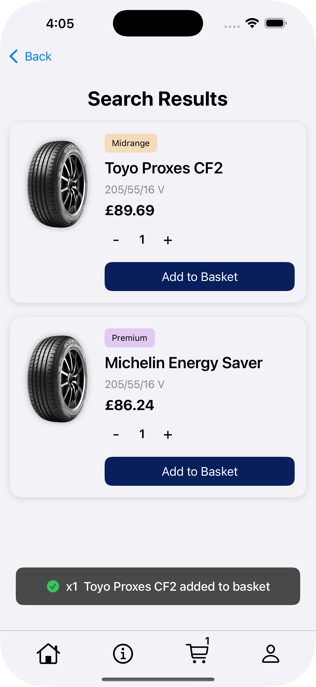
  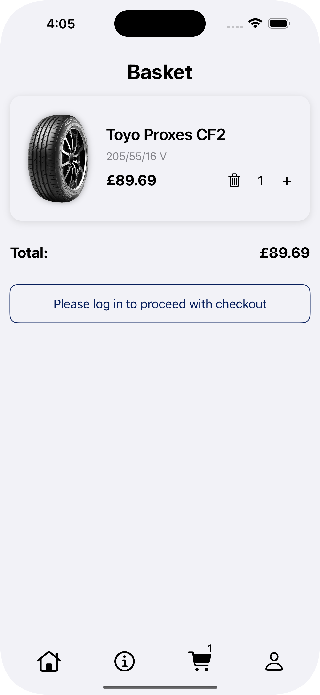
  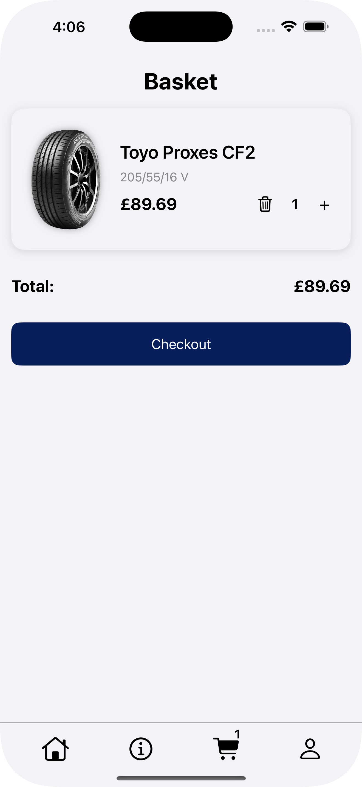

#### Checkout  
A clear, step-by-step process for finalising tyre orders. This view guides users through confirming order details, selecting fitting dates and completing payment ensuring a smooth user experience.

  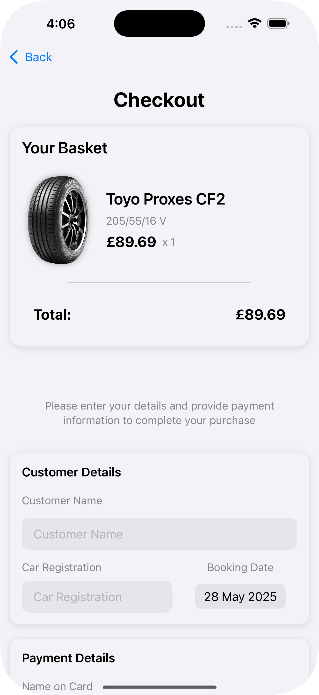
  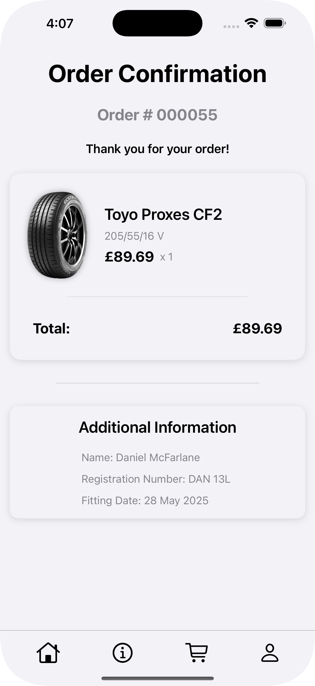

#### Customer Account  
A personalised view where customers can review their order history, track current orders and change passwords.

  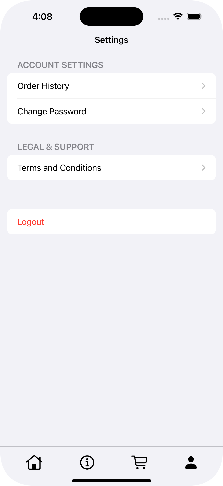
  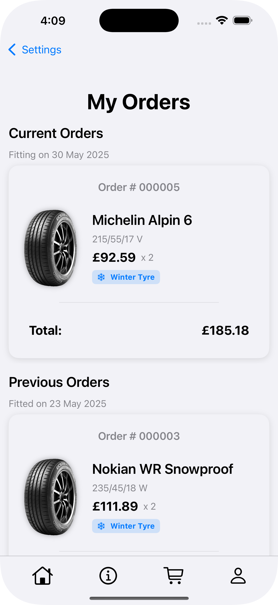

#### Staff Account  
A personalised view extending the customer account. Staff can view orders but do not have access to sensitive administrative controls.

  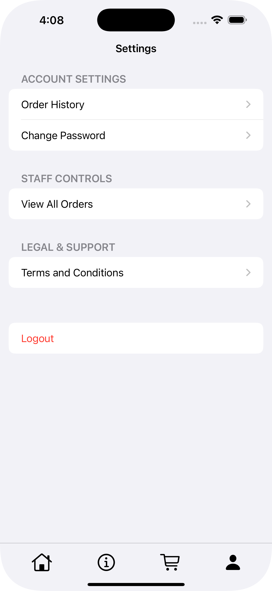
  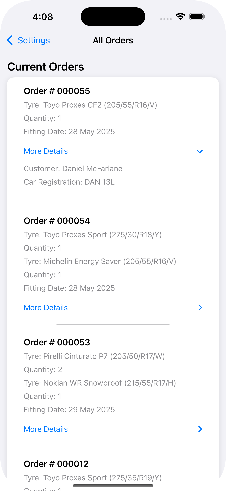

#### Admin Dashboard  
A comprehensive control panel for administrators featuring full system management capabilities. Admins can oversee users, add new users while assigning roles, manage tyre inventories and configure system settings to maintain smooth operations.

  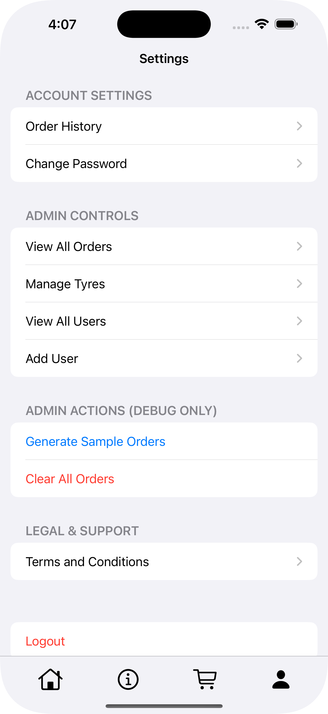
  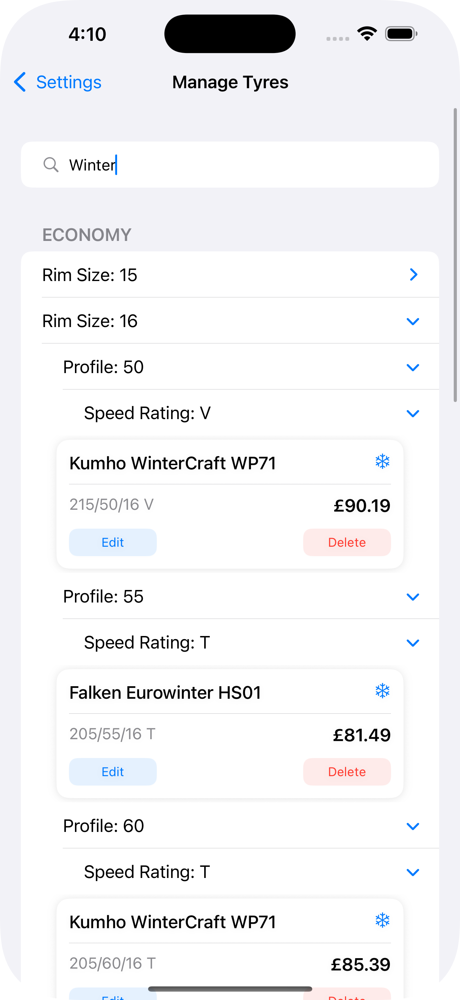
  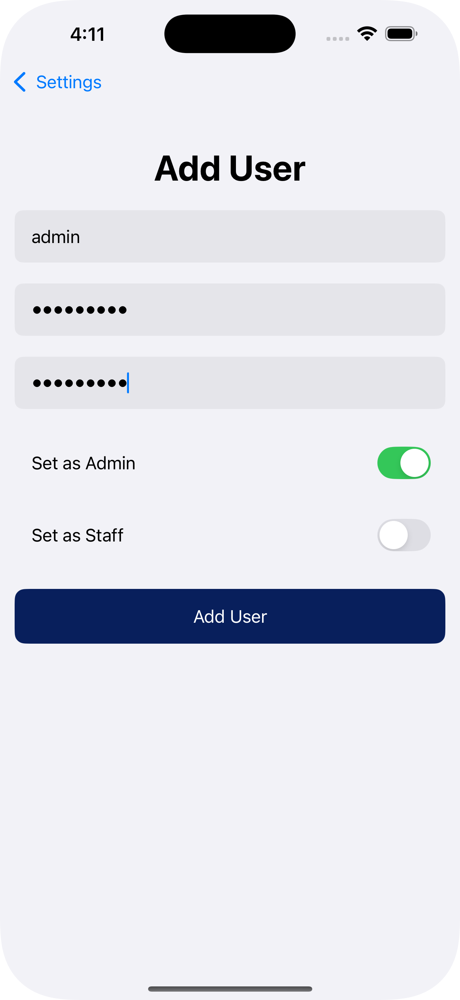

